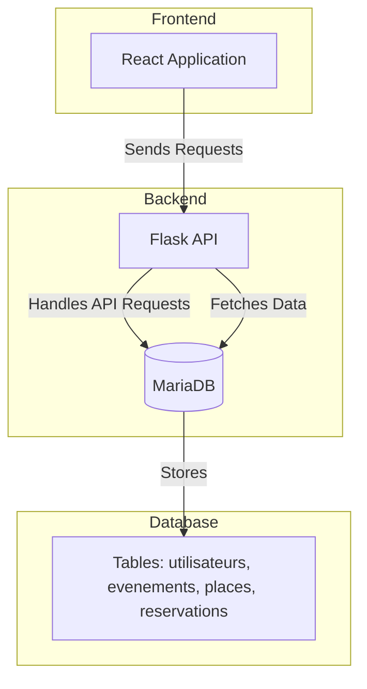

# Diagramme C4 - Event Ticket Reservation System

## Description
- **Frontend** : Une application React qui gère l'interface utilisateur.
- **Backend** : Une API Flask qui gère la logique métier et les interactions avec la base de données.
- **Database** : Une base de données MariaDB qui stocke les informations des utilisateurs, événements, places et réservations.
