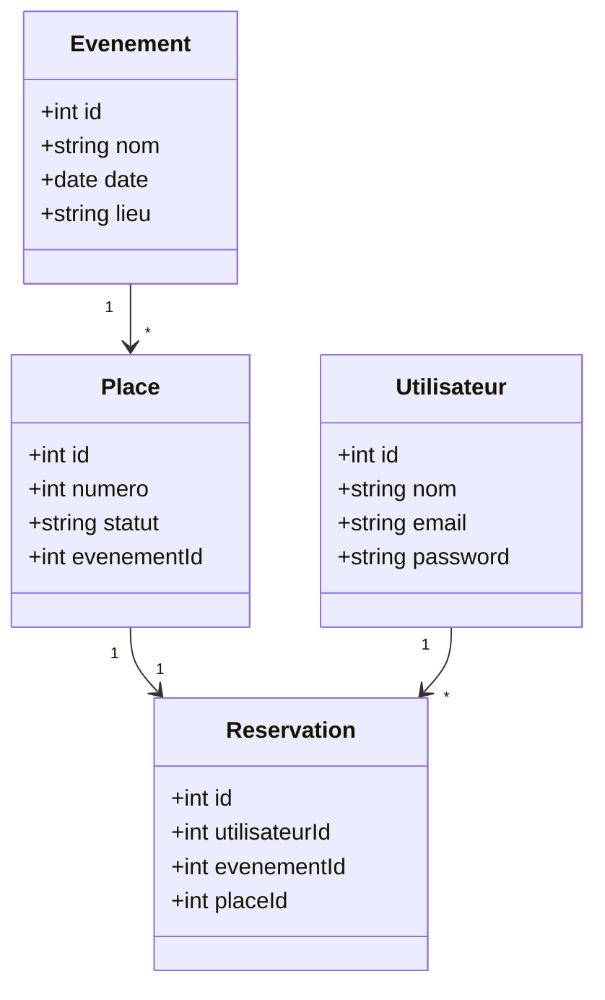

# Diagramme de Classes - Event Ticket Reservation System

## Description
- **Evenement** : Représente un événement avec un nom, une date et un lieu.
- **Place** : Représente une place associée à un événement, avec un numéro et un statut (libre/réservée).
- **Reservation** : Représente une réservation effectuée par un utilisateur pour une place dans un événement.
- **Utilisateur** : Représente un utilisateur avec un nom, un email et un mot de passe haché.
